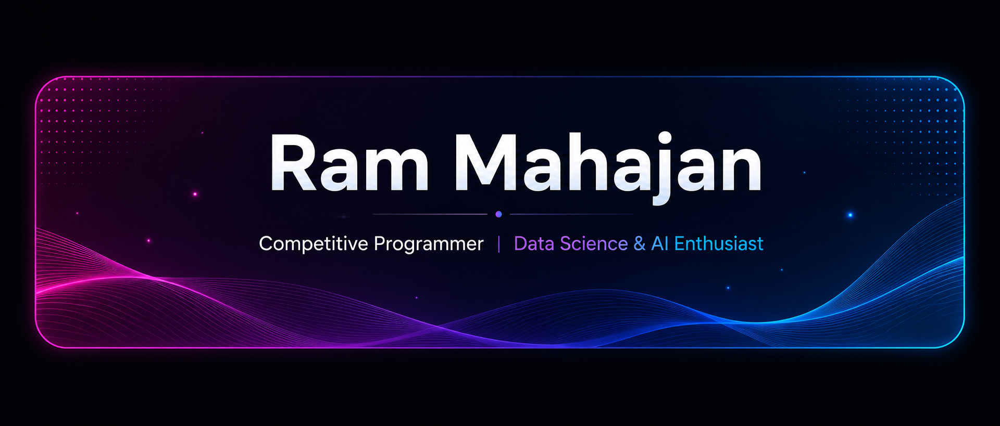

# Hi there, I'm Ram Mahajan

 

  
  
  
  

  
  
  
  

  

  

---

## 👨‍💻 About Me

I'm a **Computer Science undergraduate at Vishwakarma Institute of Technology (VIT), Pune**, passionate about building scalable software systems, solving algorithmic problems, and creating AI-powered applications.

I’m passionate about Data Science and Artificial Intelligence, with a strong interest in machine learning, data-driven problem solving, and building intelligent solutions for real-world challenges

**Currently focused on:**

- 🤖 AI / ML & AI-powered products
- 🧠 Data Structures & Algorithms
- 🏆 Competitive Programming
- 💡 Building practical products that solve real-world problems

---

## 🎓 Education

<table>
<tr>
<td>

**Vishwakarma Institute of Technology, Pune**
B.Tech — Computer Science
2024 – 2028
📊 **CGPA: 9.01 / 10.00** *(through Semester IV)*

</td>
</tr>
</table>

---

## 🚀 Featured Projects

<table width="100%">
<tr>
<td width="50%" valign="top">

### 🤖 AskMyNotes
**AI-Powered RAG Study Assistant**

A RAG-based platform that lets students upload their own study PDFs and ask questions directly from their notes.

**Highlights**
- 📄 PDF-based question answering
- 🔎 Semantic search using embeddings
- 🧠 Vector-database-powered retrieval
- 🤖 Groq & Gemini LLM integration
- ⚡ REST API architecture

**Tech:** `React` `Node.js` `Supabase` `RAG` `Embeddings` `Groq` `Gemini`

</td>
<td width="50%" valign="top">

### 🏙️ CivicMate
**AI Civic Issue Reporting System**

A civic complaint platform enabling citizens to report issues like potholes, garbage overflow, and broken streetlights with location data, plus dedicated interfaces for admins and field workers.

**Highlights**
- 📍 GPS-enabled issue reporting
- 🧑‍💼 Admin dashboard
- 👷 Worker portal
- 📊 Complaint tracking
- 🗺️ Maps integration

**Tech:** `React.js` `Node.js` `Supabase` `Google Maps API` `Tailwind CSS`

</td>
</tr>
<tr>
<td width="50%" valign="top">

### 🌱 EcoCred
**Intelligent Sustainability & Recommendation System**

An AI-powered sustainability platform combining OCR and machine learning to verify purchases and recommend sustainable products.

**Highlights**
- 🧾 Receipt OCR
- 🔍 Automated purchase-data extraction
- 🤖 Machine-learning recommendations
- 🌱 Sustainable product discovery
- ⚡ FastAPI backend

**Tech:** `React.js` `Python` `FastAPI` `OCR` `Machine Learning`

</td>
<td width="50%" valign="top">

### 🧠 What I Like Building

Systems that combine software engineering with intelligent automation:

- 🤖 AI-powered applications
- 🔎 RAG & semantic search
- 📊 Data-driven systems
- 🧩 Developer-focused tools

> **Build → Learn → Improve → Repeat.**

</td>
</tr>
</table>

---

<h2>🛠️ Tech Stack</h2>

<h4>Languages</h4>

  
  
  

<h4>Frontend</h4>

  
  

<h4>Database</h4>

  

<h4>Cloud</h4>

  

<h4>Tools</h4>

  
  
  

## 🏆 Highlights

|       Achievement | Result |
|:---:|:---:|
| 🥇 Scratch That Code Hackathon | **6th Place — 80+ Teams** |
| 🏆 Odoo Hackathon | **Top 70 — 800+ Teams** |
| 💻 LeetCode | **250+ Problems Solved** |
| 🎯 Maharashtra CET | **98.79 Percentile** |

## 💻 Competitive Programming

<table width="100%">
<tr>
<td width="50%" align="center">

**LeetCode**

</td>
<td width="50%" align="center">

**CodeChef**

</td>
</tr>
</table>

## 📚 Research & Publications

<table width="100%">
<tr>
<td width="50%" valign="top">

### 🚑 Smart Green Corridors
**An IoT-Based System for Ambulance Route Optimization**

Research proposing an IoT-enabled framework for:
- 🚑 Intelligent ambulance routing
- 🚦 Traffic-signal prioritization
- 🧠 IoT-enabled emergency transportation systems

**2026** · IEEE Xplore

</td>
<td width="50%" valign="top">

### 🌱 EcoCred (Research)
**An Intelligent Sustainability Management and Recommendation System Using OCR and Machine Learning**

Published in **Grenze International Journal of Engineering and Technology**, Vol. 12, Issue 2 — **2026**

</td>
</tr>
</table>

---

## 📊 GitHub Analytics

  

## 📈 Contribution Activity

  

---

## 🎯 Current Goals

<table>
<tr>
<th>🎯 Goal</th>
</tr>

<tr>
<td>🚀 Build production-ready software systems</td>
</tr>

<tr>
<td>🤖 Explore RAG, AI Agents & Machine Learning</td>
</tr>

<tr>
<td>🧠 Improve Competitive Programming skills</td>
</tr>

<tr>
<td>💼 Secure a Software Engineering Internship</td>
</tr>

</table>

## 🤝 Let's Connect

  
  
  
  
  

<h3 align="center">⭐ Building scalable software · Solving problems · Creating impact ⭐</h3>

  

